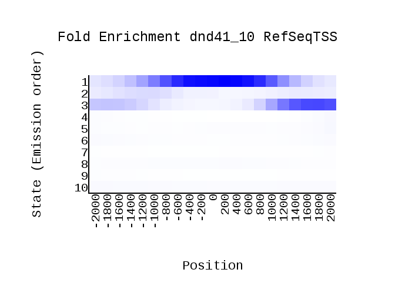

# hse_hw3_chromhmm
Весь код задания представлен в ноутбуке \
[https://colab.research.google.com/drive/1qBVcj6y-m--EQWT0a4Ms29exoG7Xeca7?usp=sharing](https://colab.research.google.com/drive/1qBVcj6y-m--EQWT0a4Ms29exoG7Xeca7?usp=sharing) \
Таблица использованных меток для анализа генома
| Метка | Название файла |
|-------|--------|
| H2AFZ	| wgEncodeBroadHistoneDnd41H2azAlnRep1.bam |
| H3k04me1	| wgEncodeBroadHistoneDnd41H3k04me1AlnRep1.bam |
| H3k04me2	| wgEncodeBroadHistoneDnd41H3k04me2AlnRep1.bam |
| H3k04me3	| wgEncodeBroadHistoneDnd41H3k04me3AlnRep1.bam |
| H3k09ac	| wgEncodeBroadHistoneDnd41H3k09acAlnRep1.bam |
| H3k09me3	| wgEncodeBroadHistoneDnd41H3k09me3AlnRep1.bam |
| H3k27me3	| wgEncodeBroadHistoneDnd41H3k27me3AlnRep1.bam |
| H3k36me3	| wgEncodeBroadHistoneDnd41H3k36me3AlnRep1.bam |
| H3k79me2	| wgEncodeBroadHistoneDnd41H3k79me2AlnRep1.bam |
| H4k20me1	| wgEncodeBroadHistoneDnd41H4k20me1AlnRep1.bam |
|ctcf	| wgEncodeBroadHistoneDnd41CtcfAlnRep1.bam |

Так же для построения разметки ChromHMM использовалась доступная информация по белкам CTCF \
Файле cellmarkfiletable.txt является вспомогательным для программы разметки. \
Программа ChromHMM размечала геном на 10 состояний, результаты разметки находятся в папке OutputDir. \
Полученные графики \

 \

 \
Примеры генов из браузера

 \

На основе исследования позиций состояния были сделаны выводы об их назначении
| State | Имя | Пояснение |
| ---- | ---- | ---- |
| State1 | Promoter | Активный промоутер |
| State2 | Weak promoter | Слабый промоутер |
| State3 | Transcribed start | Начала транскрибирующегося генома |
| State4 | Intron | Интрон в активном гене |
| State5 | Transcribed | Активный ген |
| State6 | Transcribed | Активный ген |
| State7 | Transcribed end | Конец активного генома |
| State8 | Repressed | Репрессированные хроматин |
| State9 | Heterochromatin | Межгенное пространство |
| State10 | Heterochromatin | Репрессированный хроматин, межгенное пространство |

# Бонус
Столбец в bed-файле dnd41_10_dense.bed был изменён в соответствии с заданием и записан в файл dnd41_10_renamed.bed в папке OutputDir. Ниже показаны рисунки с переименованными состояниями

